# Introdução

Informações básicas do projeto.

* **Projeto:** [RETECHNA]
* **Repositório GitHub:** [[LINK PARA O REPOSITÓRIO NO GITHUB](https://github.com/ICEI-PUC-Minas-CC-TI/ti1-cc-2025-2-tarde-grupo-2-lixo-eletronico.git)]

* **Membros da equipe:**

  * [Arthur Lucas Ramos Monteiro](https://github.com/Arthur-Monteiro-CC) 
  * [Sabrina Siqueira dos Santos](https://github.com/Sabrina-1) 
  * [Kaique Ribeiro Rezende](https://github.com/Kaique-tec) 
  * [Samuel Teodoro Albuquerque Fragoso](https://github.com/samuelfragosoye) 
  * [Lucas Gabriel de Oliveira](https://github.com/cicrano) 
  * [Bernardo Augusto Germer Vicente]() 

A documentação do projeto é estruturada da seguinte forma:

1. Introdução
2. Contexto
3. Product Discovery
4. Product Design
5. Metodologia
6. Solução
7. Referências Bibliográficas

✅ [Documentação de Design Thinking (MIRO)](files/processo-dt.pdf)

# Contexto

## Problema

**✳️✳️✳️ O descarte inadequado de lixo eletrônico produzido no Brasil é um problema significativo, haja vista que o país ocupa o  5° lugar entres os que mais produzem esses resíduos sólidos(Jornal Nacional - G1,2024). Diversos fatores contribuem para essa problemática em questão, sendo que milhares de brasileiros não sabem o que fazer com os aparelhos encontrados em suas casas, além da ausência de logística reversa por parte das empresas. Uma das principais soluções está em medidas informativas e claras para incentivar a população a levar os eletrônicos que não são mais utilizados a pontos de coleta geograficamente próximos, destinando esses materiais para o local adequado. ✳️✳️✳️**
> [Brasil é o 5º país que mais produz resíduos eletrônicos, mas descarte correto ainda é pequeno](https://g1.globo.com/jornal-nacional/noticia/2024/04/27/brasil-e-o-5o-pais-que-mais-produz-residuos-eletronicos-mas-descarte-correto-ainda-e-pequeno.ghtml)

## Objetivos

**✳️✳️✳️Os fatores determinantes para que o descarte eletrônico fosse pautado estão na percepção obtida de que há desinformação e falta de procedimentos simples que permitam que esses dispositivos cumpram o seu ciclo de vida de forma sustentável. A proposta consiste no desenvolvimento de um software capaz de simplificar o processo, reunindo dados que contribuam para o conhecimento da população sobre o assunto, bem como tornando prática a localização de pontos de coleta próximos às suas residências. Entre os principais objetivos percorridos, destacam-se: 1. buscar a compreensão que a população possui sobre o conceito de descarte eletrônico; 2. esboçar um protótipo que oriente o usuário com mapas e funcionalidades simplificadas; 3. analisar sites ou plataformas existentes que oferecem funcionalidades relacionadas ao descarte eletrônico, coleta ou orientação ao cidadão.  ✳️✳️✳️**

## Justificativa

**✳️✳️✳️O objeto de estudo sobre o tema "descarte de lixo eletrônico"  fundamenta-se em ressaltar sua urgência e necessidade ambiental. Além de ser pouco tratado nos meios de comunicação e políticas públicas,  o descarte inadequado traz problemáticas ambientais quanto à contaminação do solo e da água por metais pesados. A função embasada do projeto é evidenciar esses riscos e pontuar a relevância do descarte adequado dos dispositivos em desuso, orientando a população e empresas sobre como desfazer-se dos aparelhos, considerando os aspectos mencionados. A base de pesquisa se estendeu desde sites de notícias até videoaula, que contribuíram para a compreensão da problemática.✳️✳️✳️**
[Lixo eletrônico: descarte adequado ainda é difícil](https://youtu.be/LlR-H33soaE?si=LHBMtWv6atod6MiN)
[Legislação sobre reciclagem de eletrônicos no Brasil](https://gruporeciclo.com/legislacao-sobre-reciclagem-de-eletronicos-no-brasil/)


## Público-Alvo

**✳️✳️✳️ COLOQUE AQUI O SEU TEXTO ✳️✳️✳️**

> Descreva quais são as pessoas que usarão a sua aplicação indicando os diferentes perfis. A ideia é, dentro do possível, conhecer um pouco mais sobre o perfil dos usuários: conhecimentos prévios, relação com a tecnologia, relações hierárquicas, etc.
>
> Adicione informações sobre o público-alvo por meio de uma descrição textual, ou diagramas de personas, mapa de stakeholders, ou como o grupo achar mais conveniente.
>
> **Orientações**:
>
> - [Público-alvo: o que é, tipos, como definir seu público e exemplos](https://klickpages.com.br/blog/publico-alvo-o-que-e/)
> - [Qual a diferença entre público-alvo e persona?](https://rockcontent.com/blog/diferenca-publico-alvo-e-persona/)

# Product Discovery

## Etapa de Entendimento
##### Matriz CSD
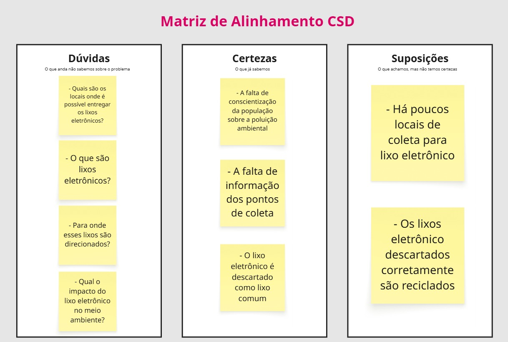

##### Mapa de stakeholders


##### Entrevistas qualitativas
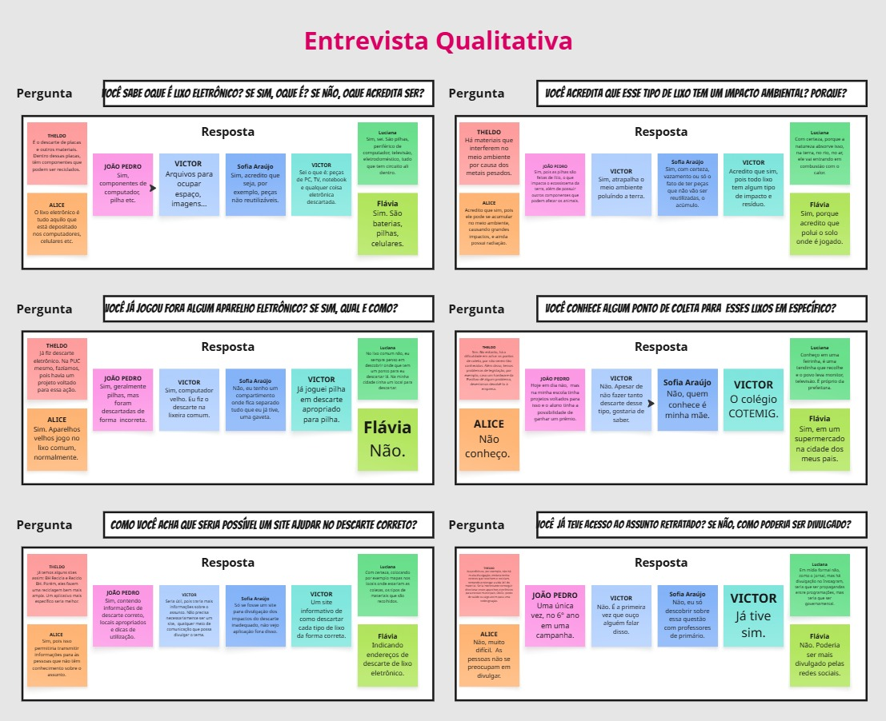

##### Highlights de pesquisa
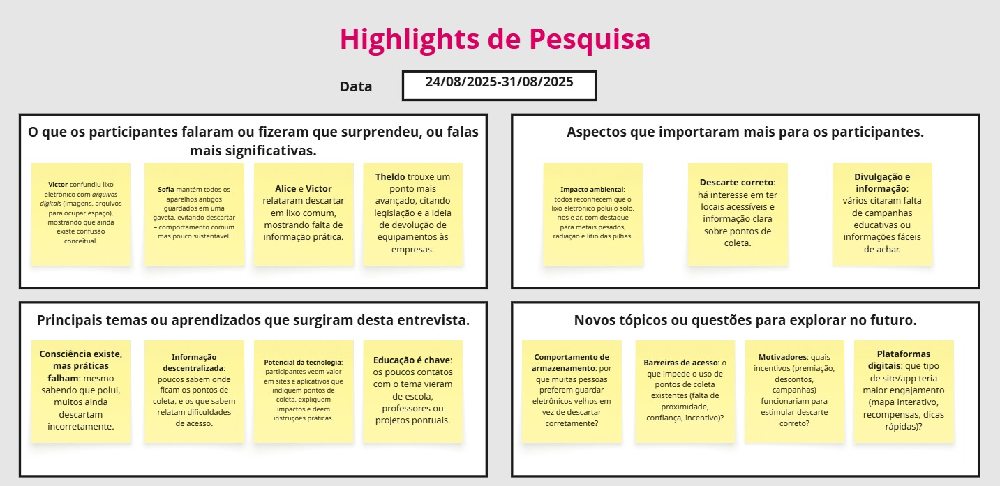


## Etapa de Definição

### Personas

**✳️✳️✳️Jose Augusto D'Ávilla✳️✳️✳️**
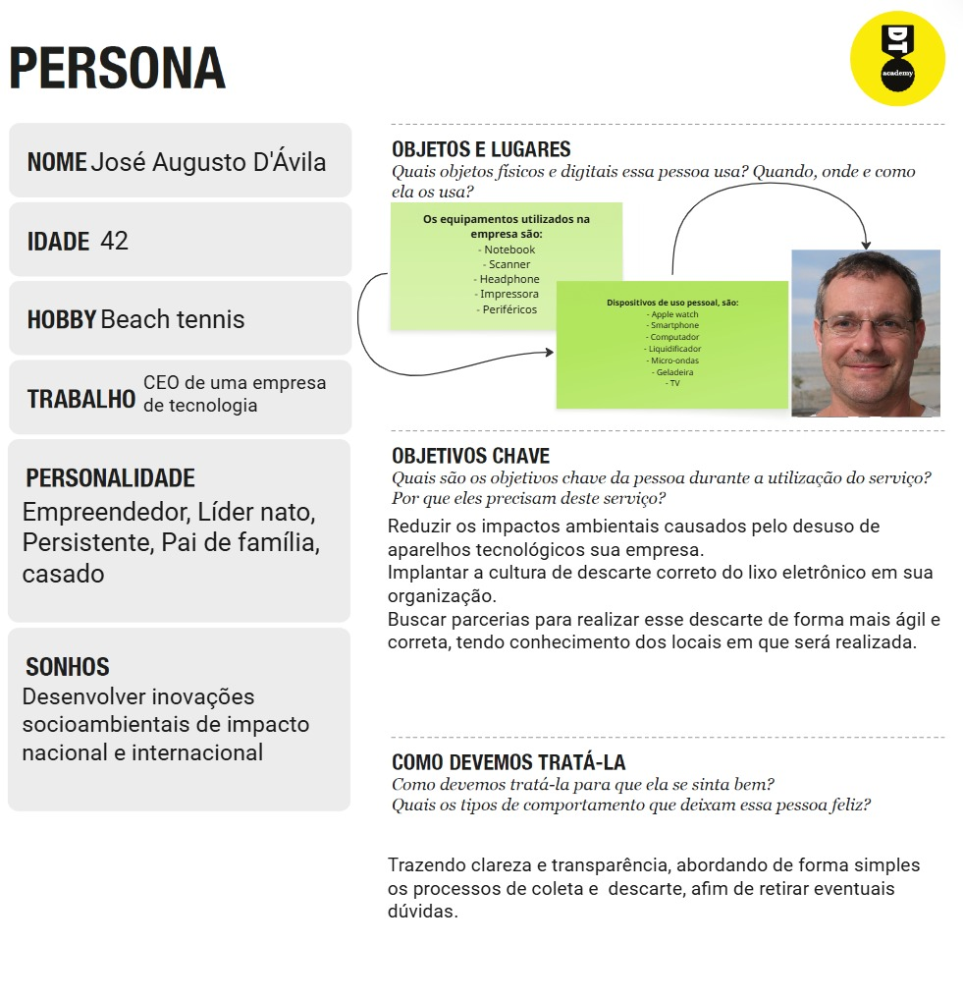

**✳️✳️✳️Brenda Miranda✳️✳️✳️**


# Product Design

Nesse momento, vamos transformar os insights e validações obtidos em soluções tangíveis e utilizáveis. Essa fase envolve a definição de uma proposta de valor, detalhando a prioridade de cada ideia e a consequente criação de wireframes, mockups e protótipos de alta fidelidade, que detalham a interface e a experiência do usuário.

## Histórias de Usuários
Com base na análise das personas foram identificadas as seguintes histórias de usuários:

| EU COMO...`PERSONA` | QUERO/PRECISO ...`FUNCIONALIDADE`        | PARA ...`MOTIVO/VALOR`               |
| --------------------- | ------------------------------------------ | -------------------------------------- |
| José Augusto D'Ávila | Localizar(mapa) pontos de coleta próximos a empresa | Fazer o descarte dos aparelhos em desuso |
| Brenda Miranda | Conteúdos informativos | Manter-se atualizada sobre melhores práticas ambientais |
| Brenda Miranda | Interface intuitiva e objetiva nas informações | Não me sentir sobrecarregada com outras informações e encontrar o que preciso rapidamente |
| José Augusto D'Ávila | Informações detalhadas sobre os pontos de coleta, como horários e tipos de materiais aceitos | Poder criar relatórios e alinhar as práticas da minha empresa |
| José Augusto D'Ávila | Acesso a dados e informações sobre sustentabilidade de acordo com as metas propostas pelos ODS | Fazer o descarte dos aparelhos em desuso |
| Brenda Miranda | Informações rápidas para eventuais duvidas (FAQ) | Sanar questionamentos e compartilhar o conhecimento com meus amigos |
| José Augusto D'Ávila | Lista de pontos de coleta de lixo eletrônico | Estabelecer parcerias de redesignação dos dispositivos |
| José Augusto D'Ávila | Filtrar os lugares  que são especializados em descarte eletrônico | Direcionar os eletrônicos para o tratamento correto no ciclo de reciclagem |
| Brenda Miranda | Classificar empresas que adotam práticas sustentáveis | Validar sua responsabilidade social

## Proposta de Valor

##### Proposta para Persona Jose Augusto D'Ávilla
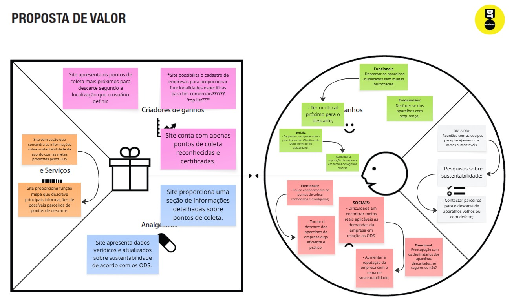

##### Proposta para Persona Brenda Miranda
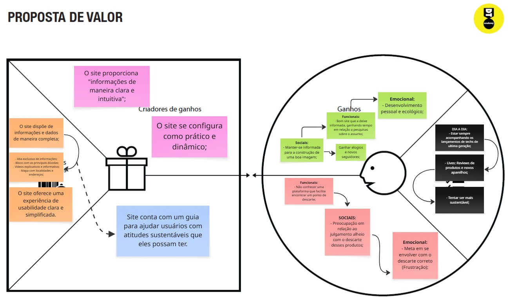

## Requisitos

As tabelas que se seguem apresentam os requisitos funcionais e não funcionais que detalham o escopo do projeto.

### Requisitos Funcionais

| ID     | Descrição do Requisito                                   | Prioridade |
| ------ | ---------------------------------------------------------- | ---------- |
| RF-001 | Cadastro Pessoa Jurídica/Física | ALTA       |
| RF-002 | Informativos(Matérias) | MÉDIA     |
| RF-003  | FAQ (Perguntas Frequentes) | BAIXA |
| RF-004 | Informativos(Vídeos) | MÉDIA |
| RF-005 | Filtros por localização | ALTA |
| RF-006 | Mapa interativo | ALTA |
| RF-007 | Feedback (pontos de coleta) | MÉDIA |
| RF-008 | Informativos(Carrossel) | MÉDIA |
| RF-009 | Like(apoiar/classificar empresa) | MÉDIA |
| RF-010 | Lista de empresas/instituições de coleta | ALTA |
| RF-011 | Cadastro de dispositivos eletrônicos (usuários e empresas) | ALTA |


### Requisitos não Funcionais

| ID     | Descrição do Requisito                                   | Prioridade |
| ------ | ---------------------------------------------------------- | ---------- |
| RNF-001 | O sistema deverá estar disponível em formato 7/24 | ALTA     |
| RNF-002 | O site estará disponível em uma plataforma de hospedagem da internet    | ALTA      |
| RNF-003 | O site deverá ser responsivo permitindo a visualização em outros dispositivos | MÉDIA     |
| RNF-004 |  Desenvolvimento em html, css, Javascript e json | ALTA     |


## Projeto de Interface

Artefatos relacionados com a interface e a interacão do usuário na proposta de solução.

### Wireframes

Estes são os protótipos de telas do sistema.

##### TELA HOME 

Descrição do site
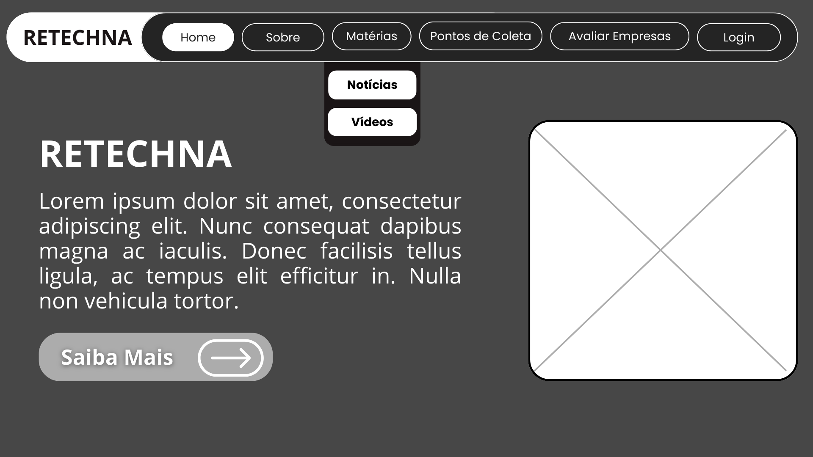

Carrossel de imagens
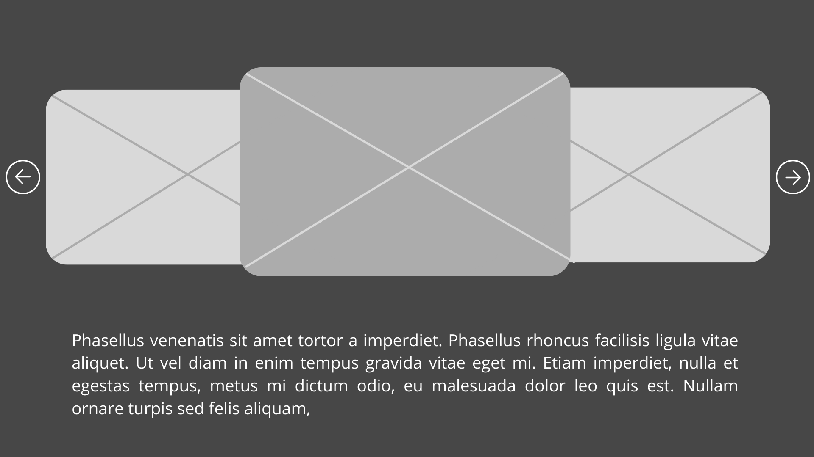

Rodapé
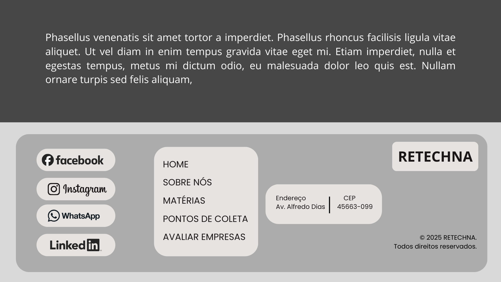

##### TELA SOBRE  

Informações sobre os desenvolvedores do site
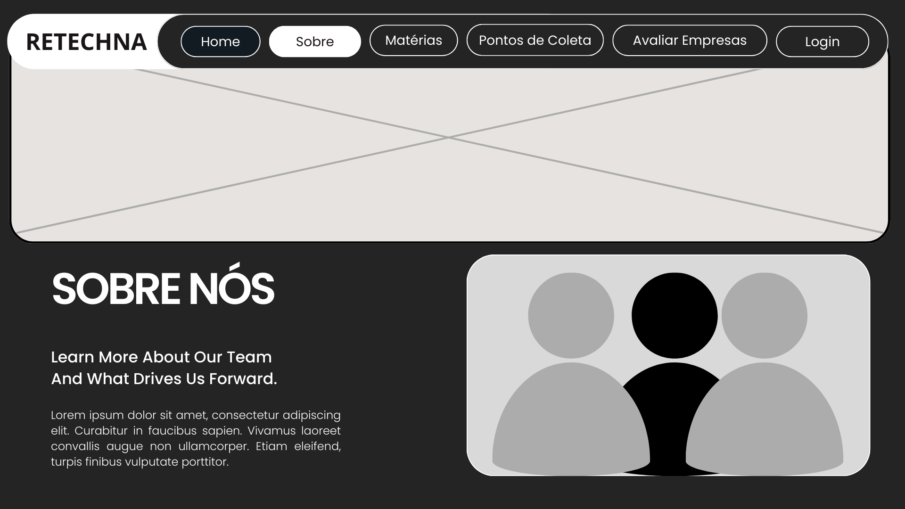

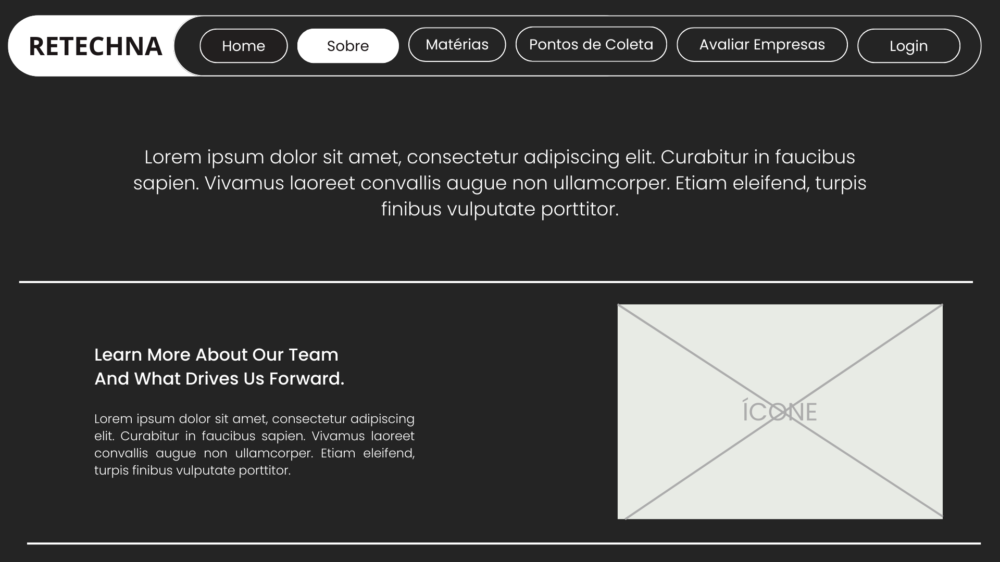

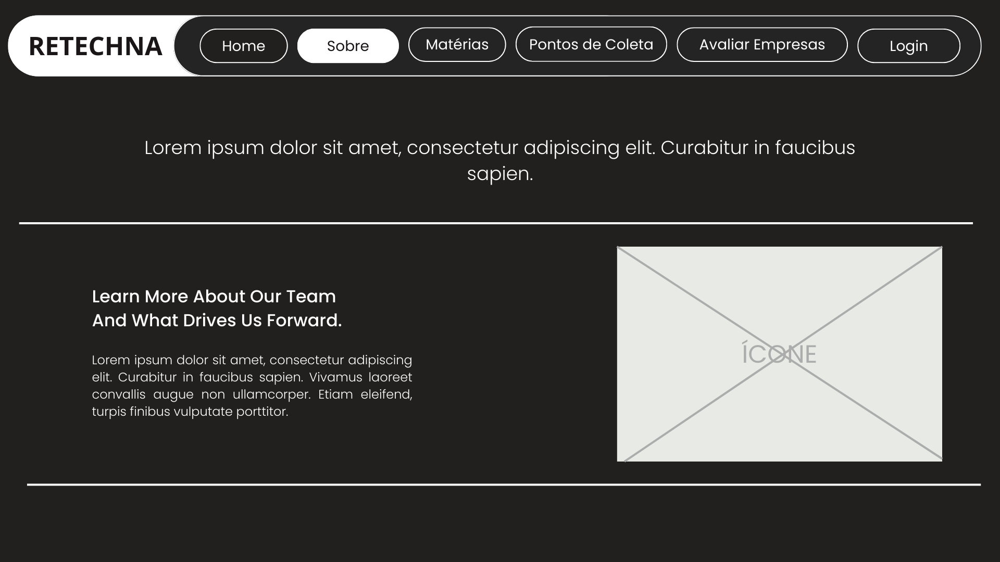

##### TELA MATÉRIAS

Notícias com o tema de sustentabilidade
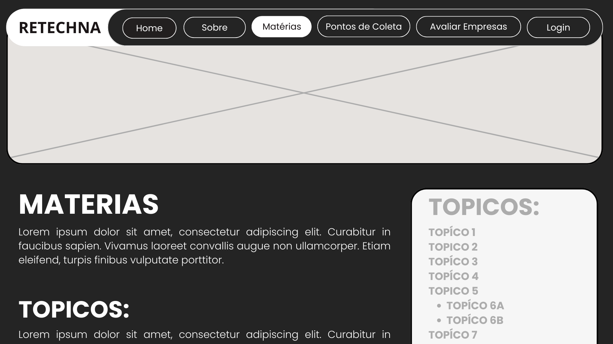

Vídeos


##### TELA PONTOS DE COLETA

Mapa com os pontos de coleta próximos
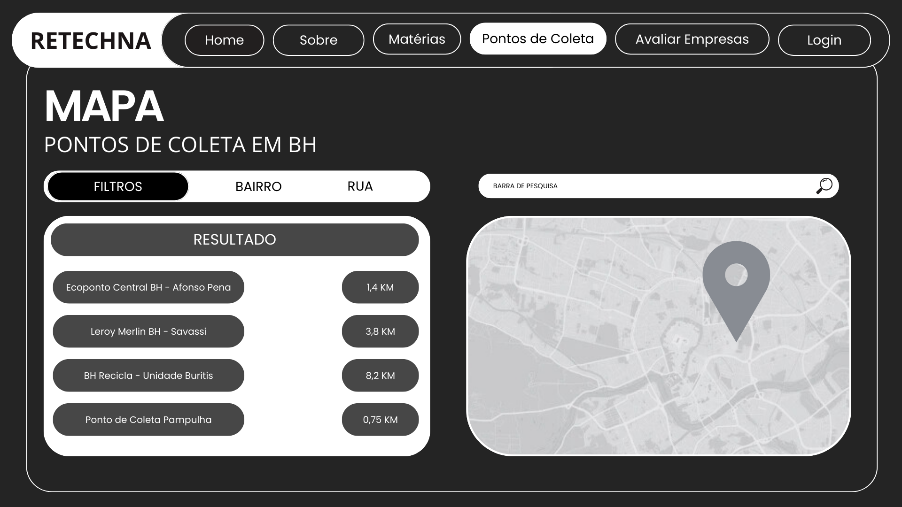

Filtro de localização
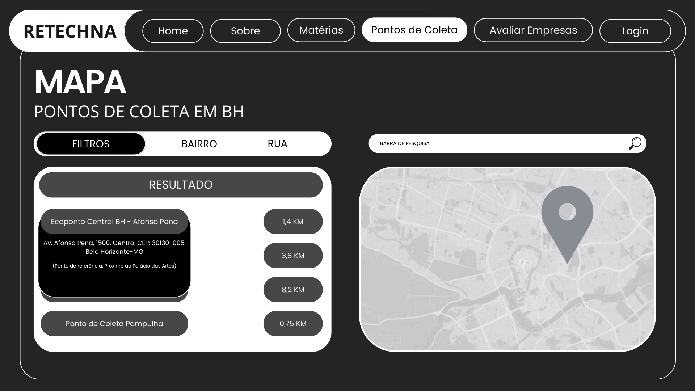

##### TELA AVALIA-NOS

Sessão de avaliar as empresas parceiras
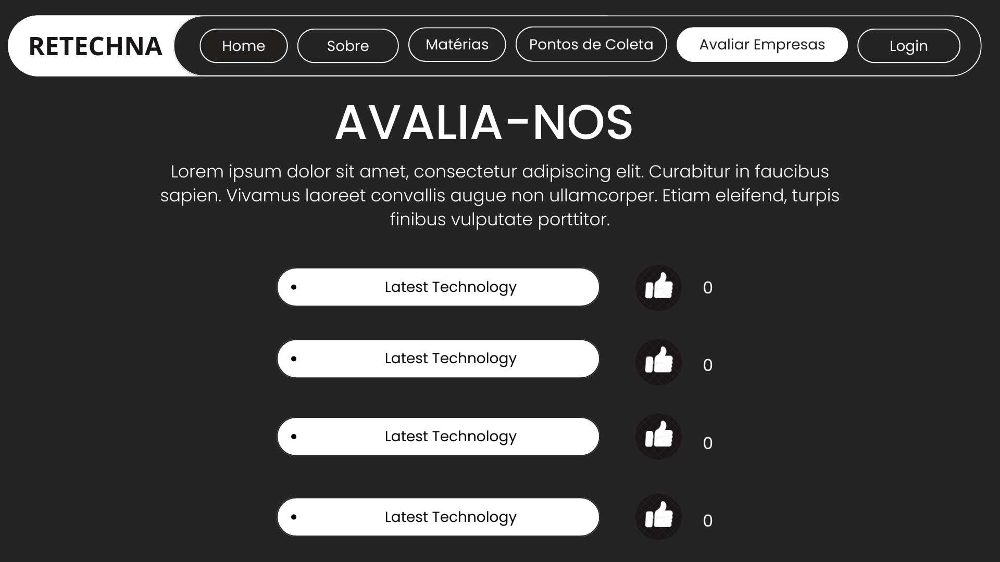

##### TELA FEEDBACK

Sessão de feedback sobre os pontos de coleta
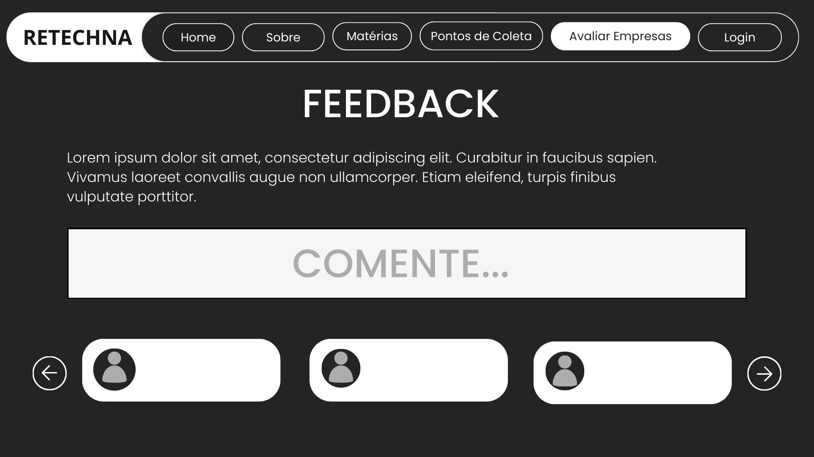


### User Flow

**✳️✳️✳️ COLOQUE AQUI O DIAGRAMA DE FLUXO DE TELAS ✳️✳️✳️**


> ⚠️ **APAGUE ESSA PARTE ANTES DE ENTREGAR SEU TRABALHO**
>
> Fluxo de usuário (User Flow) é uma técnica que permite ao desenvolvedor mapear todo fluxo de telas do site ou app. Essa técnica funciona para alinhar os caminhos e as possíveis ações que o usuário pode fazer junto com os membros de sua equipe.
>
> **Orientações**:
>
> - [User Flow: O Quê É e Como Fazer?](https://medium.com/7bits/fluxo-de-usu%C3%A1rio-user-flow-o-que-%C3%A9-como-fazer-79d965872534)
> - [User Flow vs Site Maps](http://designr.com.br/sitemap-e-user-flow-quais-as-diferencas-e-quando-usar-cada-um/)
> - [Top 25 User Flow Tools &amp; Templates for Smooth](https://www.mockplus.com/blog/post/user-flow-tools)

### Protótipo Interativo

✅ [Protótipo Interativo (Canva) - Modo preview](https://www.canva.com/design/DAGziuPb0pE/I4Hz2RBFgK3CHWsBHunndw/edit) 

# Metodologia

Detalhes sobre a organização do grupo e o ferramental empregado.

## Ferramentas

Relação de ferramentas empregadas pelo grupo durante o projeto.

| Ambiente                    | Plataforma | Link de acesso                                     |
| --------------------------- | ---------- | -------------------------------------------------- |
| Processo de Design Thinking | Miro       | https://miro.com/XXXXXXX ⚠️ EXEMPLO ⚠️        |
| Repositório de código     | GitHub     | https://github.com/XXXXXXX ⚠️ EXEMPLO ⚠️      |
| Hospedagem do site          | Render     | https://site.render.com/XXXXXXX ⚠️ EXEMPLO ⚠️ |
| Protótipo Interativo       | MarvelApp  | https://marvelapp.com/XXXXXXX ⚠️ EXEMPLO ⚠️   |
|                             |            |                                                    |

> ⚠️ **APAGUE ESSA PARTE ANTES DE ENTREGAR SEU TRABALHO**
>
> Liste as ferramentas empregadas no desenvolvimento do projeto, justificando a escolha delas, sempre que possível. Inclua itens como: (1) Editor de código, (2) )ferramentas de comunicação, (3) )ferramentas de diagramação, (4) )plataformas de hospedagem, entre outras.

## Gerenciamento do Projeto

Divisão de papéis no grupo e apresentação da estrutura da ferramenta de controle de tarefas (Kanban).


> ⚠️ **APAGUE ESSA PARTE ANTES DE ENTREGAR SEU TRABALHO**
>
> Nesta parte do documento, você deve apresentar  o processo de trabalho baseado nas metodologias ágeis, a divisão de papéis e tarefas, as ferramentas empregadas e como foi realizada a gestão de configuração do projeto via GitHub.
>
> Coloque detalhes sobre o processo de Design Thinking e a implementação do Framework Scrum seguido pelo grupo. O grupo poderá fazer uso de ferramentas on-line para acompanhar o andamento do projeto, a execução das tarefas e o status de desenvolvimento da solução.
>
> **Orientações**:
>
> - [Sobre Projects - GitHub Docs](https://docs.github.com/pt/issues/planning-and-tracking-with-projects/learning-about-projects/about-projects)
> - [Gestão de projetos com GitHub | balta.io](https://balta.io/blog/gestao-de-projetos-com-github)
> - [(460) GitHub Projects - YouTube](https://www.youtube.com/playlist?list=PLiO7XHcmTsldZR93nkTFmmWbCEVF_8F5H)
> - [11 Passos Essenciais para Implantar Scrum no seu Projeto](https://mindmaster.com.br/scrum-11-passos/)
> - [Scrum em 9 minutos](https://www.youtube.com/watch?v=XfvQWnRgxG0)

# Solução Implementada

Esta seção apresenta todos os detalhes da solução criada no projeto.

## Vídeo do Projeto

O vídeo a seguir traz uma apresentação do problema que a equipe está tratando e a proposta de solução. ⚠️ EXEMPLO ⚠️

[](https://www.youtube.com/embed/70gGoFyGeqQ)

> ⚠️ **APAGUE ESSA PARTE ANTES DE ENTREGAR SEU TRABALHO**
>
> O video de apresentação é voltado para que o público externo possa conhecer a solução. O formato é livre, sendo importante que seja apresentado o problema e a solução numa linguagem descomplicada e direta.
>
> Inclua um link para o vídeo do projeto.

## Funcionalidades

Esta seção apresenta as funcionalidades da solução.Info

##### Funcionalidade 1 - Cadastro de Contatos ⚠️ EXEMPLO ⚠️

Permite a inclusão, leitura, alteração e exclusão de contatos para o sistema

* **Estrutura de dados:** [Contatos](#ti_ed_contatos)
* **Instruções de acesso:**
  * Abra o site e efetue o login
  * Acesse o menu principal e escolha a opção Cadastros
  * Em seguida, escolha a opção Contatos
* **Tela da funcionalidade**:


> ⚠️ **APAGUE ESSA PARTE ANTES DE ENTREGAR SEU TRABALHO**
>
> Apresente cada uma das funcionalidades que a aplicação fornece tanto para os usuários quanto aos administradores da solução.
>
> Inclua, para cada funcionalidade, itens como: (1) titulos e descrição da funcionalidade; (2) Estrutura de dados associada; (3) o detalhe sobre as instruções de acesso e uso.

## Estruturas de Dados

Descrição das estruturas de dados utilizadas na solução com exemplos no formato JSON.Info

##### Estrutura de Dados - Contatos   ⚠️ EXEMPLO ⚠️

Contatos da aplicação

```json
  {
    "id": 1,
    "nome": "Leanne Graham",
    "cidade": "Belo Horizonte",
    "categoria": "amigos",
    "email": "Sincere@april.biz",
    "telefone": "1-770-736-8031",
    "website": "hildegard.org"
  }
  
```

##### Estrutura de Dados - Usuários  ⚠️ EXEMPLO ⚠️

Registro dos usuários do sistema utilizados para login e para o perfil do sistema

```json
  {
    id: "eed55b91-45be-4f2c-81bc-7686135503f9",
    email: "admin@abc.com",
    id: "eed55b91-45be-4f2c-81bc-7686135503f9",
    login: "admin",
    nome: "Administrador do Sistema",
    senha: "123"
  }
```

> ⚠️ **APAGUE ESSA PARTE ANTES DE ENTREGAR SEU TRABALHO**
>
> Apresente as estruturas de dados utilizadas na solução tanto para dados utilizados na essência da aplicação quanto outras estruturas que foram criadas para algum tipo de configuração
>
> Nomeie a estrutura, coloque uma descrição sucinta e apresente um exemplo em formato JSON.
>
> **Orientações:**
>
> * [JSON Introduction](https://www.w3schools.com/js/js_json_intro.asp)
> * [Trabalhando com JSON - Aprendendo desenvolvimento web | MDN](https://developer.mozilla.org/pt-BR/docs/Learn/JavaScript/Objects/JSON)

## Módulos e APIs

Esta seção apresenta os módulos e APIs utilizados na solução

**Images**:

* Unsplash - [https://unsplash.com/](https://unsplash.com/) ⚠️ EXEMPLO ⚠️

**Fonts:**

* Icons Font Face - [https://fontawesome.com/](https://fontawesome.com/) ⚠️ EXEMPLO ⚠️

**Scripts:**

* jQuery - [http://www.jquery.com/](http://www.jquery.com/) ⚠️ EXEMPLO ⚠️
* Bootstrap 4 - [http://getbootstrap.com/](http://getbootstrap.com/) ⚠️ EXEMPLO ⚠️

> ⚠️ **APAGUE ESSA PARTE ANTES DE ENTREGAR SEU TRABALHO**
>
> Apresente os módulos e APIs utilizados no desenvolvimento da solução. Inclua itens como: (1) Frameworks, bibliotecas, módulos, etc. utilizados no desenvolvimento da solução; (2) APIs utilizadas para acesso a dados, serviços, etc.

# Referências

As referências utilizadas no trabalho foram:

* SOBRENOME, Nome do autor. Título da obra. 8. ed. Cidade: Editora, 2000. 287 p ⚠️ EXEMPLO ⚠️

> ⚠️ **APAGUE ESSA PARTE ANTES DE ENTREGAR SEU TRABALHO**
>
> Inclua todas as referências (livros, artigos, sites, etc) utilizados no desenvolvimento do trabalho.
>
> **Orientações**:
>
> - [Formato ABNT](https://www.normastecnicas.com/abnt/trabalhos-academicos/referencias/)
> - [Referências Bibliográficas da ABNT](https://comunidade.rockcontent.com/referencia-bibliografica-abnt/)
