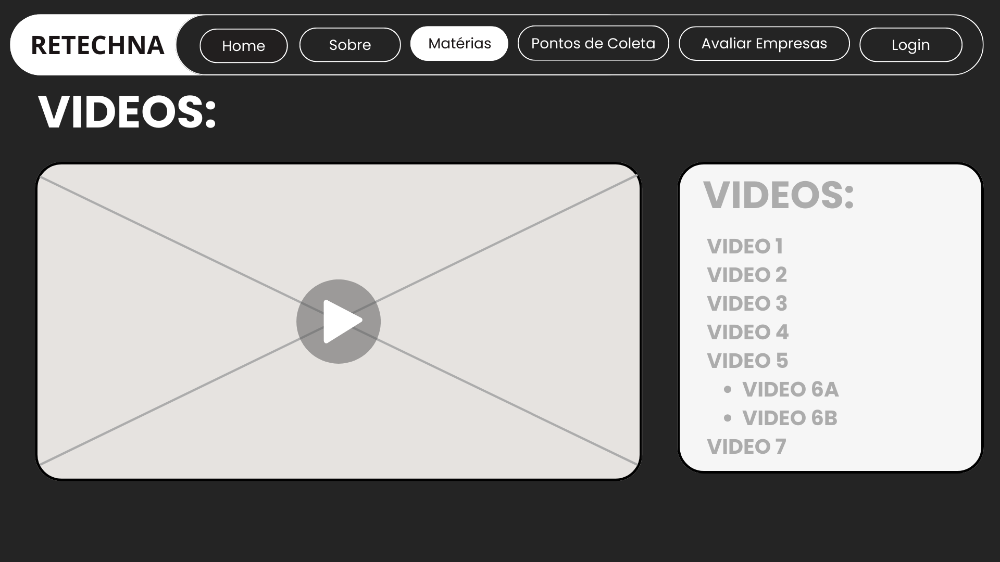

# Introdução

Informações básicas do projeto.

* **Projeto:** [RETECHNA]
* **Repositório GitHub:** [[LINK PARA O REPOSITÓRIO NO GITHUB](https://github.com/ICEI-PUC-Minas-CC-TI/ti1-cc-2025-2-tarde-grupo-2-lixo-eletronico.git)]

* **Membros da equipe:**

  * [Arthur Lucas Ramos Monteiro](https://github.com/Arthur-Monteiro-CC) 
  * [Sabrina Siqueira dos Santos](https://github.com/Sabrina-1) 
  * [Kaique Ribeiro Rezende](https://github.com/Kaique-tec) 
  * [Samuel Teodoro Albuquerque Fragoso](https://github.com/samuelfragosoye) 
  * [Lucas Gabriel de Oliveira](https://github.com/cicrano) 
  * [Bernardo Augusto Germer Vicente]() 

A documentação do projeto é estruturada da seguinte forma:

1. Introdução
2. Contexto
3. Product Discovery
4. Product Design
5. Metodologia
6. Solução
7. Referências Bibliográficas

✅ [Documentação de Design Thinking (MIRO)](files/miro.pdf)

# Contexto

## Problema

**✳️✳️✳️ O descarte inadequado de lixo eletrônico produzido no Brasil é um problema significativo, haja vista que o país ocupa o  5° lugar entres os que mais produzem esses resíduos sólidos(Jornal Nacional - G1,2024). Diversos fatores contribuem para essa problemática em questão, sendo que milhares de brasileiros não sabem o que fazer com os aparelhos encontrados em suas casas, além da ausência de logística reversa por parte das empresas. Uma das principais soluções está em medidas informativas e claras para incentivar a população a levar os eletrônicos que não são mais utilizados a pontos de coleta geograficamente próximos, destinando esses materiais para o local adequado. ✳️✳️✳️**
> [Brasil é o 5º país que mais produz resíduos eletrônicos, mas descarte correto ainda é pequeno](https://g1.globo.com/jornal-nacional/noticia/2024/04/27/brasil-e-o-5o-pais-que-mais-produz-residuos-eletronicos-mas-descarte-correto-ainda-e-pequeno.ghtml)

## Objetivos

**✳️✳️✳️Os fatores determinantes para que o descarte eletrônico fosse pautado estão na percepção obtida de que há desinformação e falta de procedimentos simples que permitam que esses dispositivos cumpram o seu ciclo de vida de forma sustentável. A proposta consiste no desenvolvimento de um software capaz de simplificar o processo, reunindo dados que contribuam para o conhecimento da população sobre o assunto, bem como tornando prática a localização de pontos de coleta próximos às suas residências. Entre os principais objetivos percorridos, destacam-se: 1. buscar a compreensão que a população possui sobre o conceito de descarte eletrônico; 2. esboçar um protótipo que oriente o usuário com mapas e funcionalidades simplificadas; 3. analisar sites ou plataformas existentes que oferecem funcionalidades relacionadas ao descarte eletrônico, coleta ou orientação ao cidadão.  ✳️✳️✳️**

## Justificativa

**✳️✳️✳️O objeto de estudo sobre o tema "descarte de lixo eletrônico"  fundamenta-se em ressaltar sua urgência e necessidade ambiental. Além de ser pouco tratado nos meios de comunicação e políticas públicas,  o descarte inadequado traz problemáticas ambientais quanto à contaminação do solo e da água por metais pesados. A função embasada do projeto é evidenciar esses riscos e pontuar a relevância do descarte adequado dos dispositivos em desuso, orientando a população e empresas sobre como desfazer-se dos aparelhos, considerando os aspectos mencionados. A base de pesquisa se estendeu desde sites de notícias até videoaula, que contribuíram para a compreensão da problemática.✳️✳️✳️**
[Lixo eletrônico: descarte adequado ainda é difícil](https://youtu.be/LlR-H33soaE?si=LHBMtWv6atod6MiN)
[Legislação sobre reciclagem de eletrônicos no Brasil](https://gruporeciclo.com/legislacao-sobre-reciclagem-de-eletronicos-no-brasil/)

## Público-Alvo

# Product Discovery

## Etapa de Entendimento
##### Matriz CSD

##### Mapa de stakeholders

##### Entrevistas qualitativas

##### Highlights de pesquisa

## Etapa de Definição

### Personas

**✳️✳️✳️Jose Augusto D'Ávilla✳️✳️✳️**

**✳️✳️✳️Brenda Miranda✳️✳️✳️**

# Product Design

Nesse momento, vamos transformar os insights e validações obtidos em soluções tangíveis e utilizáveis. Essa fase envolve a definição de uma proposta de valor, detalhando a prioridade de cada ideia e a consequente criação de wireframes, mockups e protótipos de alta fidelidade, que detalham a interface e a experiência do usuário.

## Histórias de Usuários
Com base na análise das personas foram identificadas as seguintes histórias de usuários:

| EU COMO...`PERSONA` | QUERO/PRECISO ...`FUNCIONALIDADE`        | PARA ...`MOTIVO/VALOR`               |
| --------------------- | ------------------------------------------ | -------------------------------------- |
| José Augusto D'Ávila | Localizar(mapa) pontos de coleta próximos a empresa | Fazer o descarte dos aparelhos em desuso |
| Brenda Miranda | Conteúdos informativos | Manter-se atualizada sobre melhores práticas ambientais |
| Brenda Miranda | Interface intuitiva e objetiva nas informações | Não me sentir sobrecarregada com outras informações e encontrar o que preciso rapidamente |
| José Augusto D'Ávila | Informações detalhadas sobre os pontos de coleta, como horários e tipos de materiais aceitos | Poder criar relatórios e alinhar as práticas da minha empresa |
| José Augusto D'Ávila | Acesso a dados e informações sobre sustentabilidade de acordo com as metas propostas pelos ODS | Fazer o descarte dos aparelhos em desuso |
| Brenda Miranda | Informações rápidas para eventuais duvidas (FAQ) | Sanar questionamentos e compartilhar o conhecimento com meus amigos |
| José Augusto D'Ávila | Lista de pontos de coleta de lixo eletrônico | Estabelecer parcerias de redesignação dos dispositivos |
| José Augusto D'Ávila | Filtrar os lugares  que são especializados em descarte eletrônico | Direcionar os eletrônicos para o tratamento correto no ciclo de reciclagem |
| Brenda Miranda | Classificar empresas que adotam práticas sustentáveis | Validar sua responsabilidade social

## Proposta de Valor

##### Proposta para Persona Jose Augusto D'Ávilla

##### Proposta para Persona Brenda Miranda

## Requisitos

As tabelas que se seguem apresentam os requisitos funcionais e não funcionais que detalham o escopo do projeto.

### Requisitos Funcionais

| ID     | Descrição do Requisito                                   | Prioridade |
| ------ | ---------------------------------------------------------- | ---------- |
| RF-001 | Cadastro Pessoa Jurídica/Física | ALTA       |
| RF-002 | Informativos(Matérias) | MÉDIA     |
| RF-003  | FAQ (Perguntas Frequentes) | BAIXA |
| RF-004 | Informativos(Vídeos) | MÉDIA |
| RF-005 | Filtros por localização | ALTA |
| RF-006 | Mapa interativo | ALTA |
| RF-007 | Feedback (pontos de coleta) | MÉDIA |
| RF-008 | Informativos(Carrossel) | MÉDIA |
| RF-009 | Like(apoiar/classificar empresa) | MÉDIA |
| RF-010 | Lista de empresas/instituições de coleta | ALTA |
| RF-011 | Cadastro de dispositivos eletrônicos (usuários e empresas) | ALTA |

### Requisitos não Funcionais

| ID     | Descrição do Requisito                                   | Prioridade |
| ------ | ---------------------------------------------------------- | ---------- |
| RNF-001 | O sistema deverá estar disponível em formato 7/24 | ALTA     |
| RNF-002 | O site estará disponível em uma plataforma de hospedagem da internet    | ALTA      |
| RNF-003 | O site deverá ser responsivo permitindo a visualização em outros dispositivos | MÉDIA     |
| RNF-004 |  Desenvolvimento em html, css, Javascript e json | ALTA     |

## Projeto de Interface

Artefatos relacionados com a interface e a interacão do usuário na proposta de solução.

### Wireframes

Estes são os protótipos de telas do sistema.

##### TELA HOME 

Descrição do site

Carrossel de imagens

Rodapé

##### TELA SOBRE  

Informações sobre os desenvolvedores do site

##### TELA MATÉRIAS

Notícias com o tema de sustentabilidade

Vídeos

##### TELA PONTOS DE COLETA

Mapa com os pontos de coleta próximos

Filtro de localização

##### TELA AVALIA-NOS

Sessão de avaliar as empresas parceiras

##### TELA FEEDBACK

Sessão de feedback sobre os pontos de coleta

### User Flow

**✳️✳️✳️Diagrama✳️✳️✳️**

### Protótipo Interativo

✅ [Protótipo Interativo (Canva) - Modo preview](https://www.canva.com/design/DAGziuPb0pE/I4Hz2RBFgK3CHWsBHunndw/edit) 
