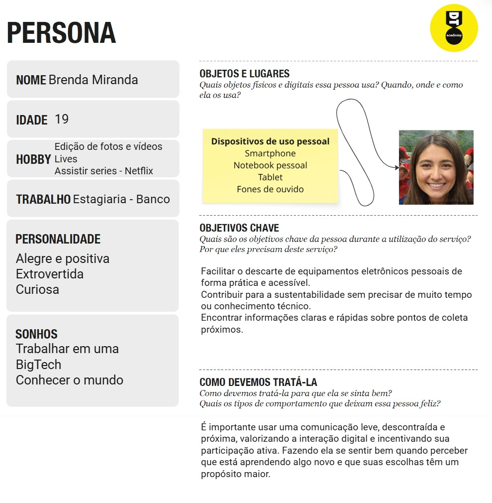

# Introdução

Informações básicas do projeto.

- **Projeto:** [RETECHNA]
- **Repositório GitHub:** [[LINK PARA O REPOSITÓRIO NO GITHUB](https://github.com/ICEI-PUC-Minas-CC-TI/ti1-cc-2025-2-tarde-grupo-2-lixo-eletronico.git)]

- **Membros da equipe:**

  - [Arthur Lucas Ramos Monteiro](https://github.com/Arthur-Monteiro-CC)
  - [Sabrina Siqueira dos Santos](https://github.com/Sabrina-1)
  - [Kaique Ribeiro Rezende](https://github.com/Kaique-tec)
  - [Samuel Teodoro Albuquerque Fragoso](https://github.com/samuelfragosoye)
  - [Lucas Gabriel de Oliveira](https://github.com/cicrano)
  - [Bernardo Augusto Germer Vicente]()

A documentação do projeto é estruturada da seguinte forma:

1. Introdução
2. Contexto
3. Product Discovery
4. Product Design
5. Metodologia
6. Solução
7. Referências Bibliográficas

[Documentação de Design Thinking (MIRO)](files/miro.pdf)

# Contexto

## Problema

**O descarte inadequado de lixo eletrônico produzido no Brasil é um problema significativo, haja vista que o país ocupa o  5° lugar entres os que mais produzem esses resíduos sólidos(Jornal Nacional - G1,2024). Diversos fatores contribuem para essa problemática em questão, sendo que milhares de brasileiros não sabem o que fazer com os aparelhos encontrados em suas casas, além da ausência de logística reversa por parte das empresas. Uma das principais soluções está em medidas informativas e claras para incentivar a população a levar os eletrônicos que não são mais utilizados a pontos de coleta geograficamente próximos, destinando esses materiais para o local adequado.**

> [Brasil é o 5º país que mais produz resíduos eletrônicos, mas descarte correto ainda é pequeno](https://g1.globo.com/jornal-nacional/noticia/2024/04/27/brasil-e-o-5o-pais-que-mais-produz-residuos-eletronicos-mas-descarte-correto-ainda-e-pequeno.ghtml)

## Objetivos

**Os fatores determinantes para que o descarte eletrônico fosse pautado estão na percepção obtida de que há desinformação e falta de procedimentos simples que permitam que esses dispositivos cumpram o seu ciclo de vida de forma sustentável. A proposta consiste no desenvolvimento de um software capaz de simplificar o processo, reunindo dados que contribuam para o conhecimento da população sobre o assunto, bem como tornando prática a localização de pontos de coleta próximos às suas residências. Entre os principais objetivos percorridos, destacam-se: 1. buscar a compreensão que a população possui sobre o conceito de descarte eletrônico; 2. esboçar um protótipo que oriente o usuário com mapas e funcionalidades simplificadas; 3. analisar sites ou plataformas existentes que oferecem funcionalidades relacionadas ao descarte eletrônico, coleta ou orientação ao cidadão.**

## Justificativa

**O objeto de estudo sobre o tema "descarte de lixo eletrônico" fundamenta-se em ressaltar sua urgência e necessidade ambiental. Além de ser pouco tratado nos meios de comunicação e políticas públicas, o descarte inadequado traz problemáticas ambientais quanto à contaminação do solo e da água por metais pesados. A função embasada do projeto é evidenciar esses riscos e pontuar a relevância do descarte adequado dos dispositivos em desuso, orientando a população e empresas sobre como desfazer-se dos aparelhos, considerando os aspectos mencionados. A base de pesquisa se estendeu desde sites de notícias até videoaula, que contribuíram para a compreensão da problemática.**
[Lixo eletrônico: descarte adequado ainda é difícil](https://youtu.be/LlR-H33soaE?si=LHBMtWv6atod6MiN)
[Legislação sobre reciclagem de eletrônicos no Brasil](https://gruporeciclo.com/legislacao-sobre-reciclagem-de-eletronicos-no-brasil/)

## Público-Alvo




# Product Discovery

## Etapa de Entendimento

##### Matriz CSD


##### Mapa de stakeholders


##### Entrevistas qualitativas


##### Highlights de pesquisa


## Etapa de Definição

### Personas

**✳️✳️✳️Jose Augusto D'Ávilla✳️✳️✳️**


**✳️✳️✳️Brenda Miranda✳️✳️✳️**


# Product Design

Nesse momento, vamos transformar os insights e validações obtidos em soluções tangíveis e utilizáveis. Essa fase envolve a definição de uma proposta de valor, detalhando a prioridade de cada ideia e a consequente criação de wireframes, mockups e protótipos de alta fidelidade, que detalham a interface e a experiência do usuário.

## Histórias de Usuários

Com base na análise das personas foram identificadas as seguintes histórias de usuários:

| EU COMO...`PERSONA`  | QUERO/PRECISO ...`FUNCIONALIDADE`                                                              | PARA ...`MOTIVO/VALOR`                                                                    |
| -------------------- | ---------------------------------------------------------------------------------------------- | ----------------------------------------------------------------------------------------- |
| José Augusto D'Ávila | Localizar(mapa) pontos de coleta próximos a empresa                                            | Fazer o descarte dos aparelhos em desuso                                                  |
| Brenda Miranda       | Conteúdos informativos                                                                         | Manter-se atualizada sobre melhores práticas ambientais                                   |
| Brenda Miranda       | Interface intuitiva e objetiva nas informações                                                 | Não me sentir sobrecarregada com outras informações e encontrar o que preciso rapidamente |
| José Augusto D'Ávila | Informações detalhadas sobre os pontos de coleta, como horários e tipos de materiais aceitos   | Poder criar relatórios e alinhar as práticas da minha empresa                             |
| José Augusto D'Ávila | Acesso a dados e informações sobre sustentabilidade de acordo com as metas propostas pelos ODS | Fazer o descarte dos aparelhos em desuso                                                  |
| Brenda Miranda       | Informações rápidas para eventuais duvidas (FAQ)                                               | Sanar questionamentos e compartilhar o conhecimento com meus amigos                       |
| José Augusto D'Ávila | Lista de pontos de coleta de lixo eletrônico                                                   | Estabelecer parcerias de redesignação dos dispositivos                                    |
| José Augusto D'Ávila | Filtrar os lugares  que são especializados em descarte eletrônico                              | Direcionar os eletrônicos para o tratamento correto no ciclo de reciclagem                |
| Brenda Miranda       | Classificar empresas que adotam práticas sustentáveis                                          | Validar sua responsabilidade social                                                       |

## Proposta de Valor

##### Proposta para Persona Jose Augusto D'Ávilla


##### Proposta para Persona Brenda Miranda


## Requisitos

As tabelas que se seguem apresentam os requisitos funcionais e não funcionais que detalham o escopo do projeto.

### Requisitos Funcionais

| ID     | Descrição do Requisito                                     | Prioridade |
| ------ | ---------------------------------------------------------- | ---------- |
| RF-001 | Cadastro Pessoa Jurídica/Física                            | ALTA       |
| RF-002 | Informativos(Matérias)                                     | MÉDIA      |
| RF-003 | FAQ (Perguntas Frequentes)                                 | BAIXA      |
| RF-004 | Informativos(Vídeos)                                       | MÉDIA      |
| RF-005 | Filtros por localização                                    | ALTA       |
| RF-006 | Mapa interativo                                            | ALTA       |
| RF-007 | Feedback (pontos de coleta)                                | MÉDIA      |
| RF-008 | Informativos(Carrossel)                                    | MÉDIA      |
| RF-009 | Like(apoiar/classificar empresa)                           | MÉDIA      |
| RF-010 | Lista de empresas/instituições de coleta                   | ALTA       |
| RF-011 | Cadastro de dispositivos eletrônicos (usuários e empresas) | ALTA       |

### Requisitos não Funcionais

| ID      | Descrição do Requisito                                                        | Prioridade |
| ------- | ----------------------------------------------------------------------------- | ---------- |
| RNF-001 | O sistema deverá estar disponível em formato 7/24                             | ALTA       |
| RNF-002 | O site estará disponível em uma plataforma de hospedagem da internet          | ALTA       |
| RNF-003 | O site deverá ser responsivo permitindo a visualização em outros dispositivos | MÉDIA      |
| RNF-004 | Desenvolvimento em html, css, Javascript e json                               | ALTA       |

## Projeto de Interface

Artefatos relacionados com a interface e a interacão do usuário na proposta de solução.

### Wireframes

Estes são os protótipos de telas do sistema.

##### TELA HOME

Descrição do site


Carrossel de imagens


Rodapé


##### TELA SOBRE

Informações sobre os desenvolvedores do site


##### TELA MATÉRIAS

Notícias com o tema de sustentabilidade


Vídeos


##### TELA PONTOS DE COLETA

Mapa com os pontos de coleta próximos


Filtro de localização


##### TELA AVALIA-NOS

Sessão de avaliar as empresas parceiras


##### TELA FEEDBACK

Sessão de feedback sobre os pontos de coleta


### User Flow

**Diagrama**


### Protótipo Interativo

[Protótipo Interativo (Canva) - Modo preview](https://www.canva.com/design/DAGziuPb0pE/I4Hz2RBFgK3CHWsBHunndw/edit)

# Metodologia

Detalhes sobre a organização do grupo e o ferramental empregado.

## Ferramentas

Relação de ferramentas empregadas pelo grupo durante o projeto.

| Ambiente                    | Plataforma | Link de acesso                                                                                                                                                                                                                                                              |
| --------------------------- | ---------- | --------------------------------------------------------------------------------------------------------------------------------------------------------------------------------------------------------------------------------------------------------------------------- |
| Processo de Design Thinking | Miro       | https://miro.com/welcomeonboard/VS9DL2hlc2lDSEprcG1YbDEzcWtjVVd2OThiL1BuQmltTTZ6MUVXQTJBQU5EdXI0VWJWSTJNSGRGdEVkRmtKY1kwZEVhNVlSM3dxLzBwajI3ZTNCTXBZMzNjR3B3aXN4KzFnb3pqUHZHdUtsc2prcXlCeXNSKzNaeDM0TkRweFlNakdSWkpBejJWRjJhRnhhb1UwcS9BPT0hdjE=?share_link_id=516667191531 |
| Repositório de código       | GitHub     | https://github.com/ICEI-PUC-Minas-CC-TI/ti1-cc-2025-2-tarde-grupo-2-lixo-eletronico/tree/master                                                                                                                                                                             |
| Hospedagem do site          | Vercel     | https://retechna.vercel.app                                                                                                                                                                                                                                                 |
| Protótipo Interativo        | Canva      | https://www.canva.com/design/DAGziuPb0pE/I4Hz2RBFgK3CHWsBHunndw/edit                                                                                                                                                                                                        |
| Reuniões e chamadas online  | Discord    | https://discord.com/channels/1418939338175152200/1418939338959355905                                                                                                                                                                                                        |

1. MIRO - Essa ferramenta foi utilizada ao longo da construção do projeto com o objetivo de organizar, categorizar e entender as informações que o grupo possuia em relação ao projeto, pesquisa, opniões.

2. GITHUB - Foi escolhido por ser a principal ferramenta no que diz respeito a versionamento de código, possibilitando ao grupo criar branchs e desenvolver a solução em partes.

3. VERSEL - Usado para hospedar online o projeto final, escolhido por ser mais simples.

4. CANVA - Utilizado na prototipação do projeto, sendo de muito facil manejo, por essa ferramenta foram desenvolvidos os wireframes interativos, com o objetivo do grupo já ter uma noção final de como poderia ser construido o projeto.

5. DISCORD - Essa plataforma foi utilizada pelo grupo pela praticidade de criar chamadas que é o foco da plataforma, o que possibilitou ao grupo faazer reuniões e analisar em tempo real, a partir da opção "compartilhar tela", o que estava sendo desenvolvido por cada membro;

## Gerenciamento do Projeto

Divisão de papéis no grupo e apresentação da estrutura da ferramenta de controle de tarefas (Kanban).

- OBS: Ao longo de toda a estruturação do projeto e de sua implementação, não foi utilizado nenhuma ferramenta de controle de tarefas especifico, a organização e distribuição de tarefas foi observado de acordo com a capacidade e o interesse pessoal de cada membro por determinada funcionalidade.

# Solução Implementada

Esta seção apresenta todos os detalhes da solução criada no projeto.

## Vídeo do Projeto

O vídeo a seguir traz uma apresentação do problema que a equipe está tratando e a proposta de solução.

[](https://www.youtube.com/embed/70gGoFyGeqQ)

## Funcionalidades

Esta seção apresenta as funcionalidades da solução. Info

##### Funcionalidade 1 - CADASTRO DE MATÉRIAS

Permite a inclusão, leitura, alteração e exclusão das matérias (notícias) que serão exibidas na sessão de materias.

- **Instruções de acesso:**
  - Abra o site e efetue o login
  - Acesse o menu principal e escolha a opção Gerenciar (CRUD)
  - Escolha a opção: Materias
- **Tela da funcionalidade**:


##### Funcionalidade 2 - CADASTRO DE VÍDEOS

Permite a inclusão, leitura, alteração e exclusão dos vídeos que serão exibidas na sessão de materias.

- **Instruções de acesso:**
- Abra o site e efetue o login
- Acesse o menu principal e escolha a opção Gerenciar (CRUD)
- Escolha a opção: Vídeos
- **Tela da funcionalidade**:


##### Funcionalidade 3 - CADASTRO DE PRODUTOS

Permite a inclusão, leitura, alteração e exclusão de produtos que serão exibidas na sessão do Mapa, em Filtros.

- **Instruções de acesso:**
- Abra o site e efetue o login
- Acesse o menu principal e escolha a opção Gerenciar (CRUD)
- Escolha a opção: Produtos
- **Tela da funcionalidade**:


##### Funcionalidade 4 - CARROSEL

Permite ao usuário ver as principais matérias e a partir dele escolher qual acessar.

- **Instruções de acesso:**
  - Acesse a pagína princial (HOME)
  - Navegue entre as matérias exibidas
- **Tela da funcionalidade**:


##### Funcionalidade 5 - FAQ

Permite ao usuário tirar suas principais dúvidas sobre o sitema/site quanto sobre o tema geral do projeto "Descaste de Lixo Eletrônico"

- **Instruções de acesso:**
  - Acesse a pagína principal (HOME)
  - Role com o mouse até o fim da pagína
  - Escolha qual das dúvidas se encaixa com a sua e clique para revelar a resposta
- **Tela da funcionalidade**:


##### Funcionalidade 6 - MAPA FILTRO

Permite ao usuário pesquisar e descobrir os pontos de coleta mais proxímos de determinada localidade a escolha do usuário.

- **Instruções de acesso:**
  - Acesse o menu principal e escolha a opção Pontos de Coleta
  - Selecione no filtro qual opção que deseja filtrar
- **Tela da funcionalidade**:


##### Funcionalidade 7 - MAPA PESQUISA

Permite a inclusão, leitura, alteração e exclusão das matérias (notícias) que serão exibidas na sessão de materias.

- **Instruções de acesso:**
  - Acesse o menu principal e escolha a opção Pontos de Coleta
  - Clique no campo de pesquisa
  - Digite o endereço ou produto que deseja descartar
- **Tela da funcionalidade**:


##### Funcionalidade 8 - MAPA

Permite ao usuário visualizar em mapa os pontos de coleta de acordo com os endereços solicitados.

- **Instruções de acesso:**
  - Acesse o menu principal e escolha a opção Pontos de Coleta
  - Mapa
- **Tela da funcionalidade**:


##### Funcionalidade 9 - MATÉRIA

Permite ao usuário uma gama de opções de materias/reportagens sobre diversas tematicas dentro do contexto de Lixo eletrônico

- **Instruções de acesso:**
  - Acesse o menu principal e escolha a opção Materias
  - No Menu lateral escolha o título que lhe interessa
- **Tela da funcionalidade**:


##### Funcionalidade 10 - VÍDEOS

Permite ao usuário assistir uma gama de opções de vídeos sobre diversas tematicas dentro do contexto de Lixo eletrônico

- **Instruções de acesso:**
  - Acesse o menu principal e escolha a opção Materias
  - Role a tela
  - Escolha o titulo de vídeo que lhe interessa
  - Clique no vídeo e assista
- **Tela da funcionalidade**:


##### Funcionalidade 11 - MAPA

Permite ao usuário se cadastrar e logar em nosso site

- **Instruções de acesso:**
  - Acesse o menu principal e escolha a opção Login
  - Se houve conta clique em Entrar
  - Caso não, Clique em cadastrar
- **Tela da funcionalidade**:


## Estruturas de Dados

Descrição das estruturas de dados utilizadas na solução com exemplos no formato JSON.Info

##### Estrutura de Dados - Materias

Exemplo das Matérias da aplicação

```json
"materias": [
    {
      "id": "1",
      "titulo": "Descarte de Eletrônicos: Legislação Brasileira",
      "conteudo": "Com o crescente descarte de eletrônicos no Brasil, fez-se necessário que esse fosse devidamente regularizado, fazendo com que não só a população ficasse ciente do problema e suas consequências para o meio ambiente, mas também evitando o excesso de resíduos em locais impróprios. A partir dessa necessidade, a lei nº 9.605, regente desde 1998, foi alterada, dando origem a lei federal nº 12.305, que trata sobre a regularização do descarte de resíduos eletrônicos e que faz com que seja instituída a Política Nacional de Resíduos Sólidos.",
      "autor": "Josianne Castro",
      "width": "1200",
      "height": "400",
      "data": "2 de Novembro, 2016",
      "fonte": "https://blog.amblegis.com.br/meio-ambiente/descarte-de-eletronicos-legislacao-brasileira/",
      "url": "https://blog.amblegis.com.br/wp-content/uploads/2025/10/descarte-lixo-eletronico-capa-blogpost-1.jpg"
    },
```

##### Estrutura de Dados - Usuários

Registro dos usuários do sistema utilizados para login e para o perfil do sistema

```json
"users": [
    {
      "id": "1",
      "nome": "Ana Carla Souza",
      "e-mail": "aninha@gmail.com",
      "senha": "12345"
    },
```

##### Estrutura de Dados - Vídeos

Registro dos vídeos do sistema utilizados para a exibição do contéudo em vídeo para os usuários.

```json
"videos": [
    {
    "id": "1",
      "titulo": "Lixo Eletrônico",
      "descricao": "Este vídeo explica o que é o lixo eletrônico (ou resíduo eletrônico) e a sua crescente quantidade. Detalha a composição desses resíduos, como TVs e celulares, e o que pode ser reciclado (vidro, ferro, cobre, etc.). Alerta sobre os riscos ambientais de metais pesados contaminando rios e plantações quando o descarte é incorreto, reforçando que o consumidor é responsável pelo destino do que consome e joga fora.",
      "duracao": "04:30",
      "canal": "Momento Ambiental",
      "url": "https://www.youtube.com/embed/YIL4QRPkZU4"
    },
```

##### Estrutura de Dados - Vídeos

Registro dos vídeos do sistema utilizados para a exibição do contéudo em vídeo para os usuários.

```json
"videos": [
    {
    "id": "1",
      "titulo": "Lixo Eletrônico",
      "descricao": "Este vídeo explica o que é o lixo eletrônico (ou resíduo eletrônico) e a sua crescente quantidade. Detalha a composição desses resíduos, como TVs e celulares, e o que pode ser reciclado (vidro, ferro, cobre, etc.). Alerta sobre os riscos ambientais de metais pesados contaminando rios e plantações quando o descarte é incorreto, reforçando que o consumidor é responsável pelo destino do que consome e joga fora.",
      "duracao": "04:30",
      "canal": "Momento Ambiental",
      "url": "https://www.youtube.com/embed/YIL4QRPkZU4"
    },
```

## Módulos e APIs

Esta seção apresenta os módulos e APIs utilizados na solução

**Fonts:**

- Google Font - [https://fonts.google.com/specimen/Inter](https://fonts.google.com/specimen/Inter)

**Scripts:**

- jQuery - [http://www.jquery.com/](http://www.jquery.com/)
- Bootstrap 4 - [http://getbootstrap.com/](http://getbootstrap.com/)
- MAPBOX - [https://www.mapbox.com/](https://www.mapbox.com/)

# Referências

As referências utilizadas no trabalho foram:

- SITE: GREEN ELETRON - 11/08/2025 14:53
  [https://greeneletron.org.br/](https://greeneletron.org.br/)
- SITE: BH RECICLA - 11/08/2025 15:02
  [https://bhrecicla.com.br/](https://bhrecicla.com.br/)
